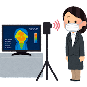

## やまびこ通信2022年3月号

No.172

2022年3月11日発行

### 2月の活動報告

{: .migi}

2月11日（金） 
定例会・勉強会

2月13日（日） 
ユニバーサル部会

2月25日（金） 
定例会・勉強会

2月25日～3月30日 ユニバーサル部 図書館２階にて パネル展示

### 3月の活動予定

{: .migi}

2月25日～3月30日 ユニバーサル部 図書館2階にて パネル展示

3月4日（金） 
東京音訳グループ連絡会 ZOOM連絡委員会

3月6日（日） 
バリアフリー映画会

3月11日（金） 
定例会・勉強会

3月13日（日） 
ユニバーサル部会

3月17日（木）
東京音訳グループ連絡会 新規 運営委員会との引継ぎ

3月25日（金）
定例会・勉強会

### 録音図書 （デイジー版CD） 製作

{: .migi}

北区図書館情報2月及び北区の部屋だより第150号  
55分

カルチャーラジオ  
4時間

世界は「関係」でできている  
9時間45分

新版 日本の島ガイド SHIMADAS 5 瀬戸内海の島々 （兵庫・岡山）  
8時間10分

ラジオで！ カムカムエヴリバディ2月号  
3時間

### 対面音訳

2月|37時間
|:---|---:|
今年度累計|412時間

### 十条台句会

<ruby>袖口<rp>(</rp><rt>そでぐち</rt><rp>)</rp></ruby>を<ruby>握<rp>(</rp><rt>にぎ</rt><rp>)</rp></ruby>り<ruby>足早<rp>(</rp><rt>あしばや</rt><rp>)</rp>
 </ruby><ruby>冴<rp>(</rp><rt>さ</rt><rp>)</rp></ruby>え<ruby>返<rp>(</rp><rt>かえ</rt><rp>)</rp></ruby>る

<ruby>英子<rp>(</rp><rt>えいこ</rt><rp>)</rp></ruby>

### 「音訳グループやまびこ」と東京都

{: .migi}

音訳グループやまびこは、
東京音訳グループ連絡会に所属しています。

東京音訳グループ連絡会は
「東京都内で活動する音訳ボランティア団体で構成している ネットワークです。
図書館や社協の所属、
上部団体あり、
まったくの自主活動など、
活動の形態はさまざまですが、
より良い音訳活動を目指すという 基本の姿勢は変わりません。

19区 15市
44団体
（令和3年12月3日現在）在籍されています。
（東京音訳グループ連絡会ブログより引用）

複数グループの参加している区や市もありますが、
音訳グループやまびこは 北区で唯一の音訳グループです。

会長から 定例会で東京音訳グループ連絡会の講演会のお知らせや 音訳募集などの報告があります。
機会があれば参加してみましょう。

### 「音訳」が新聞記事に！

#### [1] 1月14日（金）「音訳」 減る担い手 ［読売新聞夕刊11面］

タイトルに
「書籍を読み上げ、 録音」
「見えない人の読書支援」
「高齢化・研修開けず」
「音訳を利用する流れ」
「音訳の説明」
「手弁当で2000時間」
「登録団体解散」などの文字が並んでいます。

全国紙なのでたくさんの方の目に触れたのではないでしょうか？

#### [2] 2月15日（火） ボランティアにも報酬を ［読売新聞朝刊14面 投書 気流欄］

1月14日の記事を受けての投書です。

両記事とも、
お時間のある時に
読売新聞オンラインや 図書館で ご覧になりませんか？

### 新入会員のひとこと

- 昨年11月に入会させていただきましたが、 コロナ禍と 期 途中入会のため あまり皆様とご一緒する機会もないままに今日に至ってしまいました。  
  見学当日は定例会後の意見交換と勉強会がとても印象的でした。 以前活動していた会では仕事の絶対量が多く 各チームの活動日が違うため、 数年に一度 外部講師をお招きするか 都合がつけば内部での勉強会でした。  
そのため個人的な勉強のため 情報が共有されないこともありました。 今回 もう一度勉強してみたいと思い 入会しましたが、 対面朗読等 未経験なことも多いようなので、 これからゆっくり 「やまびこ」の形態に 慣れていきたいと思っていますので 今後ともよろしくお願いいたします。 (A.T.)

- 図書館での初心者向け音読講座で やまびこの活動を知り、 入会しました。 コロナで対面音訳の講習が受けられないのが残念ですが、 定例会での 会員の皆さんの和気藹々とした雰囲気が 居心地よく、 また、 研修の時間に、 見えない方に どう伝えればよいか、 いろいろな考えを聞き合うことも新鮮な体験です。 まだまだ勉強することがたくさんありそうですが、 どうぞよろしくお願いします。 (S.H.)

### Let's try!

{: .migi}

卒業の季節ですね。
学校の名前です、
卒業生はいらっしゃいますか？

そこで、
皆さま 久しぶりに校歌を歌ってみませんか？

#### 3月の問題

<blockquote markdown="1">
1. <ruby class="ruby_level_7">峡田小学校<rp>(</rp> <rt>（　　　）</rt><rp>)</rp></ruby> 荒川区  

2. <ruby>笄小学校<rp>(</rp> <rt>（　　　）</rt><rp>)</rp></ruby> 港区  

3. <ruby class="ruby_level_2">後地小学校<rp>(</rp> <rt>（　　　）</rt><rp>)</rp></ruby> 品川区  

4. <ruby> 碑小学校<rp>(</rp> <rt>（　　　）</rt><rp>)</rp></ruby> 目黒区  

5. <ruby class="ruby_level_3">油面小学校<rp>(</rp> <rt>（　　　）</rt><rp>)</rp></ruby> 目黒区  

6. <ruby class="ruby_level_1">赤土小学校<rp>(</rp> <rt>（　　　）</rt><rp>)</rp></ruby> 荒川区  

7. <ruby class="ruby_level_1">六月中学校<rp>(</rp> <rt>（　　　）</rt><rp>)</rp></ruby> 足立区
</blockquote>

#### 2月の解答

<blockquote markdown="1">

(1) 
<ruby>一向<rp>(</rp><rt>ひたすら</rt><rp>)</rp></ruby>

(2) 
<ruby>二乗<rp>(</rp><rt>にじょう</rt><rp>)</rp></ruby>

(3) 
<ruby>凡百<rp>(</rp><rt>ぼんぴゃく</rt><rp>)</rp></ruby>

(4) 
<ruby>長閑<rp>(</rp><rt>のどか</rt><rp>)</rp></ruby>

(5) 
<ruby>左見右見<rp>(</rp><rt>とみこうみ</rt><rp>)</rp></ruby>

(6) 
<ruby>食<rp>(</rp><rt>は</rt><rp>)</rp></ruby>み<ruby>出<rp>(</rp><rt>だ</rt><rp>)</rp></ruby>す

(7) 
<ruby>思<rp>(</rp><rt>おぼ</rt><rp>)</rp></ruby>しい

(8) 
<ruby>夜夜中<rp>(</rp><rt>よるよなか</rt><rp>)</rp></ruby>

(9) 
<ruby>先<rp>(</rp><rt>ま</rt><rp>)</rp></ruby>ず

(10) 
<ruby>何人<rp>(</rp><rt>なんぴと</rt><rp>)</rp></ruby>たりとも
</blockquote>

定例会: 
第2・第4金曜日10時～12時
／北区立中央図書館3階  

連絡先: 
音訳グループやまびこ代表 大川 薫  

電話番号: 
03-3910-7331  

<a data-dur="5.93" data-begin="483.241" id="xmri_009D" markdown="1" href="mailto:ymbk2016ml@gmail.com?Subject=やまびこウェブサイトについて">このサイトについてはこちらへ</a>

&nbsp;

