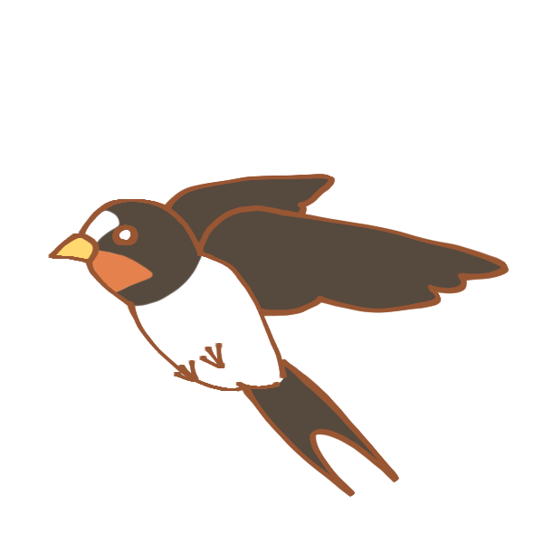

##  やまびこ通信2022年6月号

№175

2022年6月10日発行

###  5月の活動報告

{: .migi}

5月8日（日） ユニバーサル部会

5月10日（火） おちゃのこ祭祭説明会

5月13日（金） 定例会・勉強会・午後 役員会

5月27日（金） 定例会・やまびこ定期総会

###  6月の活動予定

{: .migi}

6月5日（日）ユニバーサル部会

6月10日（金）定例会・勉強会

6月12日（日）バリアフリー映画会</ br>10：00 ～14：00 ～

6月24日（金）定例会・勉強会

###  今後の予定

令和4年度 音訳者講習会（中級） 都立多摩図書館

7/1、8、14、22、29、8/5の全6回13：30 ～ 16：30

1名 （応募多数の時は多摩図書館が抽選）

###  録音図書 （デイジー版CD） 製作

新版 日本の島ガイド SHIMADAS 6瀬戸内海の島々（香川・徳島）  
10時間

新版 日本の島ガイド SHIMADAS 1北日本の島々  
11時間

新版 日本の島ガイド SHIMADAS 2北陸の島々  
8時間

北視協通信第1号 通刊273号  
15分

バネジョのお嬢様が焼くパンケーキは謎の香り  
7時間

北区図書館情報 5月 及び 北区の部屋だより 第153号  
55分

###  対面音訳

5月|73時間
|:---|---:|
今年度累計|144時間

###  十条台句会

{: .migi}

<ruby>薫風<rp>(</rp><rt>くんぷう</rt><rp>)</rp></ruby>や <ruby>宛名<rp>(</rp><rt>あてな</rt><rp>)</rp></ruby><ruby>確<rp>(</rp><rt>たし</rt><rp>)</rp></ruby>かめ <ruby>投函<rp>(</rp><rt>とうかん</rt><rp>)</rp></ruby>す
<ruby>幹雄<rp>(</rp><rt>かんゆう</rt><rp>)</rp></ruby>

###  Let's try!

{: .migi}

####  6月の問題

<blockquote markdown="1">

(1） <ruby>為人<rp>(</rp><rt>（　　　）</rt><rp>)</rp></ruby>

（2） <ruby>三和土<rp>(</rp><rt>（　　　）</rt><rp>)</rp></ruby>

（3） <ruby>所以<rp>(</rp><rt>（　　　）</rt><rp>)</rp></ruby>

（4） <ruby>女人禁制<rp>(</rp><rt>（　　　）</rt><rp>)</rp></ruby>

（5） <ruby>年中行事<rp>(</rp><rt>（　　　）</rt><rp>)</rp></ruby>

（6） <ruby>発条<rp>(</rp><rt>（　　　）</rt><rp>)</rp></ruby>

（7） <ruby>徐<rp>(</rp><rt>（　　　）</rt><rp>)</rp></ruby>に

（8） <ruby>具<rp>(</rp><rt>（　　　）</rt><rp>)</rp></ruby>に

（9） <ruby>遍<rp>(</rp><rt>（　　　）</rt><rp>)</rp></ruby>く

（10） <ruby>肯<rp>(</rp><rt>（　　　）</rt><rp>)</rp></ruby>ずる

</blockquote>

####  5月の解答

<blockquote markdown="1">

（1） 車掌にそう云うのも<ruby>業腹<rp>(</rp><rt>ごうはら</rt><rp>)</rp></ruby>だから/芥川龍之介「田端日記」

（2） 平和を<ruby>希<rp>(</rp><rt>こいねが</rt><rp>)</rp></ruby>う/宮本百合子「選集」

（3） 旧暦4月の<ruby>異名<rp>(</rp><rt>いみょう</rt><rp>)</rp></ruby>に<ruby>花残月<rp>(</rp><rt>はなのこりづき</rt><rp>)</rp></ruby>・<ruby>木葉採月<rp>(</rp><rt>このはとりづき</rt><rp>)</rp></ruby>・<ruby>麦秋<rp>(</rp><rt>ばくしゅう</rt><rp>)</rp></ruby>などもある。

（4） <ruby>土筆<rp>(</rp><rt>つくし</rt><rp>)</rp></ruby>は1日で1<ruby>糎<rp>(</rp><rt>せんち</rt><rp>)</rp></ruby>成長するため花言葉は「向上心・努力」

（5） <ruby>春宵<rp>(</rp><rt>しゅんしょう</rt><rp>)</rp></ruby>一刻値千金、月は <ruby>小望月<rp>(</rp><rt>こもちづき</rt><rp>)</rp></ruby>・<ruby>朧月<rp>(</rp><rt>おぼろづき</rt><rp>)</rp></ruby>・<ruby>十三夜<rp>(</rp><rt>じゅうさんや</rt><rp>)</rp></ruby>・<ruby>十六夜<rp>(</rp><rt>いざよい</rt><rp>)</rp></ruby>・<ruby>立待月<rp>(</rp><rt>たちまちづき</rt><rp>)</rp></ruby>・<ruby>黄昏月<rp>(</rp><rt>たそがれづき</rt><rp>)</rp></ruby>ともよばれる。

（6） まだまだ必要な マスクの着用・手洗い、 <ruby>嗽<rp>(</rp><rt>うがい</rt><rp>)</rp></ruby>

</blockquote>

定例会： 第2金曜日・第4金曜日10時～12時/北区立中央図書館3階

連絡先： 音訳グループやまびこ代表 大川薫

電話番号：03-3910-7331

<a href="mailto:ymbk2016ml@gmail.com?Subject=やまびこウェブサイトについて" data-dur="5.929" data-begin="264.629" id="xmri_0060" markdown="1">このサイトについてはこちらへ</a>

