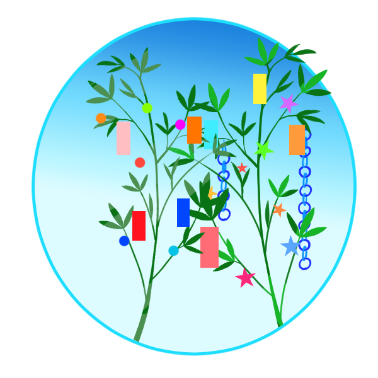

##  やまびこ通信2022年7月号

No.176

2022年7月8日発行

###  6月の活動報告

{: .migi}

6月5日（日）ユニバーサル部会

6月10日（金）定例会・勉強会

6月12日（日）バリアフリー映画会 午前10時開始/午後2時開始

6月24日（金）定例会・勉強会

###  7月の活動予定

{: .migi}

7月1日（金）令和4年度音訳者講習会（中級） 都立多摩図書館

7月8日（金）定例会・勉強会

午後・令和4年度音訳者講習会（中級） 都立多摩図書館

7月10日（日）ユニバーサル部会

7月14日（木）令和4年度音訳者講習会（中級） 都立多摩図書館

7月22日（金）定例会・勉強会

午後 令和4年度音訳者講習会（中級） 都立多摩図書館

###  今後の予定

7/29・8/5 令和4年度音訳者講習会（中級） 都立多摩図書館 13時30分～16時30分

8月6日（土） 音訳者・音訳ボランティアのための 著作権セミナー

主催 公益社団法人 日本図書館協会 障害者サービス委員会

開催形式はZoomによるオンライン 10時30分から16時40分

###  録音図書 （デイジー版CD） 製作

{: .migi}

北区図書館情報6月 及び 北区の部屋だより第154号  
55分

参議院議員選挙 啓発宣伝放送 令和4年  
4分

###  対面音訳

6月|77時間
|:---|---:|
今年度累計|221時間

###  十条台句会

<ruby>遠雷<rp>(</rp><rt>えんらい</rt><rp>)</rp></ruby>や やまばとは <ruby>胸<rp>(</rp><rt>むね</rt><rp>)</rp></ruby>たくましく
<ruby>真貴<rp>(</rp><rt>まき</rt><rp>)</rp></ruby>

###  今月は大切な資料集を見てみました。

{: .migi}

<a href="https://drive.google.com/file/d/1HmYinQR1wzOvQkhZVy23QfHU4vYQgoHQ/view?usp=share_link" data-dur="5.074" data-begin="195.766" id="xmri_003F" markdown="1">音訳グループやまびこの資料集より</a>一部抜粋しました。

なかなか手ごわい訓練です。

資料集を 再度見てみませんか。

「か」行と「は」行の 組み合わせの訓練

1. かはかひかふかへかほ はかはきはくはけはこ

2. きはきひきふきへきほ ひかひきひくひけひこ

3. くはくひくふくへくほ ふかふきふくふけふこ

4. けはけひけふけへけほ へかへきへくへけへこ

5. こはこひこふこへこほ ほかほきほくほけほこ

（平成29年度 音訳者中級講座遠藤先生 講習より）

###  Let&apos;s try!

{: .migi}

####  7月の問題

先月、図書館でリサイクル本を戴いてきましたが、その中から（鳶・続吉野川 枡谷 優）

<blockquote markdown="1">

（1）健さんが<ruby>承<rp>(</rp><rt>（　　　）</rt><rp>)</rp></ruby>ける

（2）消息に<ruby>昏<rp>(</rp><rt>（　　　）</rt><rp>)</rp></ruby>い

（3）<ruby>斑猫<rp>(</rp><rt>（　　　）</rt><rp>)</rp></ruby>が来た

（4）戻ってくるのを<ruby>機<rp>(</rp><rt>（　　　）</rt><rp>)</rp></ruby>に

（5）<ruby>泥濘<rp>(</rp><rt>（　　　）</rt><rp>)</rp></ruby>で転ぶ

（6）<ruby>頻々<rp>(</rp><rt>（　　　）</rt><rp>)</rp></ruby>と被害があり

（7）<ruby>匍<rp>(</rp><rt>（　　　）</rt><rp>)</rp></ruby>った

（8）<ruby>笊<rp>(</rp><rt>（　　　）</rt><rp>)</rp></ruby>に三度豆を摘む

（9）<ruby>小鉈<rp>(</rp><rt>（　　　）</rt><rp>)</rp></ruby>で切る

（10）<ruby>抛<rp>(</rp><rt>（　　　）</rt><rp>)</rp></ruby>りだす

</blockquote>

####  6月の解答

<blockquote markdown="1">

（1） <ruby>為人<rp>(</rp><rt>ひととなり</rt><rp>)</rp></ruby>

（2） <ruby>三和土<rp>(</rp><rt>たたき</rt><rp>)</rp></ruby>

（3） <ruby>所以<rp>(</rp><rt>ゆえん</rt><rp>)</rp></ruby>

（4） <ruby>女人禁制<rp>(</rp><rt>にょにんきんぜい</rt><rp>)</rp></ruby>

（5） <ruby>年中行事<rp>(</rp><rt>ねんじゅうぎょうじ</rt><rp>)</rp></ruby>

（6） <ruby>発条<rp>(</rp><rt>ばね</rt><rp>)</rp></ruby>

（7） <ruby>徐<rp>(</rp><rt>おもむろ</rt><rp>)</rp></ruby>に

（8） <ruby>具<rp>(</rp><rt>つぶさ</rt><rp>)</rp></ruby>に

（9） <ruby>遍<rp>(</rp><rt>あまね</rt><rp>)</rp></ruby>く

（10） <ruby>肯<rp>(</rp><rt>がえん</rt><rp>)</rp></ruby>ずる

</blockquote>

定例会： 第2金曜日・第4金曜日10時～12時/北区立中央図書館3階

連絡先： 音訳グループやまびこ代表 大川薫

電話番号：03-3910-7331

<a href="mailto:ymbk2016ml@gmail.com?Subject=やまびこウェブサイトについて" data-dur="5.930" data-begin="320.831" id="xmri_0076" markdown="1">このサイトについてはこちらへ</a>

