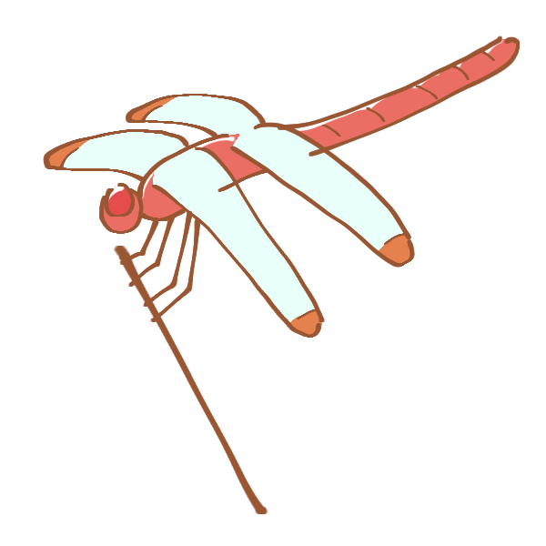
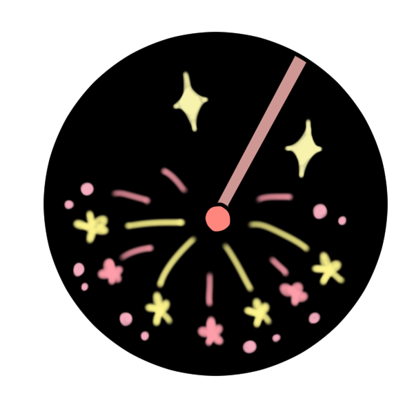

##  やまびこ通信2022年8月号

No.177

2022年8月12日発行

ケス読み上げ時間:約 6分

###  7月の活動報告

{: .migi}

7月1日（金） 令和4年度音訳者講習会（中級） 都立多摩図書館

7月8日（金） 定例会・勉強会

午後・令和4年度音訳者講習会（中級） 都立多摩図書館

7月10日（日） ユニバーサル部会

7月14日（木） 令和4年度音訳者講習会（中級） 都立多摩図書館

7月22日（金） 定例会・勉強会 ・午後 令和4年度音訳者講習会（中級） 都立多摩図書館

7月29日(金） 令和4年度音訳者講習会（中級） 都立多摩図書館

###  8月の活動予定

8月5日（金） 令和4年度音訳者講習会（中級） 都立多摩図書館

8月6日（土） 音訳者・音訳ボランティアのための 著作権セミナー

8月12日（金） 定例会・勉強会 ・夏! 体験ボランティア 2022

8月26日（金） 定例会・勉強会

8月28日（日） ユニバーサル部会

###  今後の予定

{: .migi}

9月4日（日） バリアフリー映画会10:00 ～ 12:00／14:00 ～ 16:00

9月29日（木）東京音訳グループ 講習会： 写真、 流れ図の処理

###  録音図書 （デイジー版CD）製作

{: .migi}

「新版 日本の島ガイド SHIMADAS 10日本海の島々」  
8時間30分

病証論と臨床質問について（質問録音）  
14時間30分

病証論と臨床質問について（講義録音）  
21時間20分

障害者福祉のしおり（令和4年度版）  
11時間40分

北視協通信  
15分

基幹センターだより Vol.6  
17分

北区図書館情報7月及び北区の部屋だより 第155号  
55分

###  対面音訳

7月|75時間
|:---|---:|
今年度累計|296時間

###  十条台句会

{: .migi}

<ruby>白髪頭<rp>(</rp><rt>しらがあたま</rt><rp>)</rp></ruby> <ruby>測<rp>(</rp><rt>はか</rt><rp>)</rp></ruby>りて<ruby>母<rp>(</rp><rt>はは</rt><rp>)</rp></ruby>の <ruby>夏帽子<rp>(</rp><rt>なつぼうし</rt><rp>)</rp></ruby>
<ruby>清子<rp>(</rp><rt>きよこ</rt><rp>)</rp></ruby>

###  東京都 音訳者講習（初級）に参加して

初めて受けた講習は北区の初級講座。音訳さえ知らなかった私は夢中で受けました。

今回は一年ほど対面音訳や録音を経験しての受講でした。やはり違いました。

録音と対面の違い、読み方、処理の仕方、利用者さんへの接し方等、自分の事として聞くことができました。

資料もたくさん頂いたので、これからも活用していきたいと思います。

講座の録音CDもいただける予定なので資料と合わせてキャビネットに保管します。

皆様、どうぞご利用ください。
KH

###  Let&apos;s try!

{: .migi}

####  8月の問題

<blockquote markdown="1">

（1） <ruby>興味津々<rp>(</rp><rt>（　　　）</rt><rp>)</rp></ruby>

（2） <ruby>津々浦々<rp>(</rp><rt>（　　　）</rt><rp>)</rp></ruby>

（3） <ruby>唯々諾々<rp>(</rp><rt>（　　　）</rt><rp>)</rp></ruby>

（4）<ruby> 斯く斯く云々<rp>(</rp><rt>（　　　）</rt><rp>)</rp></ruby>

（5） <ruby>子々孫々<rp>(</rp><rt>（　　　）</rt><rp>)</rp></ruby>

（6） <ruby>侃々諤々<rp>(</rp><rt>（　　　）</rt><rp>)</rp></ruby>

（7） <ruby>気息奄々<rp>(</rp><rt>（　　　）</rt><rp>)</rp></ruby>

（8） <ruby>喋々喃々<rp>(</rp><rt>（　　　）</rt><rp>)</rp></ruby>

（9） <ruby>時々刻々<rp>(</rp><rt>（　　　）</rt><rp>)</rp></ruby>

（10） <ruby>悲喜交々<rp>(</rp><rt>（　　　）</rt><rp>)</rp></ruby>

</blockquote>

####  7月の解答

<blockquote markdown="1">

（1） 健さんが<ruby>承<rp>(</rp><rt>う</rt><rp>)</rp></ruby>ける

（2） 消息に<ruby>昏<rp>(</rp><rt>くら</rt><rp>)</rp></ruby>い

（3） <ruby>斑猫<rp>(</rp><rt>ぶちねこ</rt><rp>)</rp></ruby>が来た

（4） 戻ってくるのを<ruby>機<rp>(</rp><rt>しお</rt><rp>)</rp></ruby>に

（5） <ruby>泥濘<rp>(</rp><rt>ぬかるみ</rt><rp>)</rp></ruby>で転ぶ

（6） <ruby>頻々<rp>(</rp><rt>ひんぴん</rt><rp>)</rp></ruby>と被害があり

（7） <ruby>匍<rp>(</rp><rt>はらば</rt><rp>)</rp></ruby>った

（8） <ruby>笊<rp>(</rp><rt>ざる</rt><rp>)</rp></ruby>に三度豆を摘む

（9） <ruby>小鉈<rp>(</rp><rt>こなた</rt><rp>)</rp></ruby>で切る

（10） <ruby>抛<rp>(</rp><rt>ほう</rt><rp>)</rp></ruby>りだす

</blockquote>

定例会： 第2金曜日・第4金曜日10時～12時/北区立中央図書館3階

連絡先： 音訳グループやまびこ代表 大川薫

電話番号：03-3910-7331

<a href="mailto:ymbk2016ml@gmail.com?Subject=やまびこウェブサイトについて" data-dur="5.930" data-begin="346.120" id="xmri_0087" markdown="1">このサイトについてはこちらへ</a>

