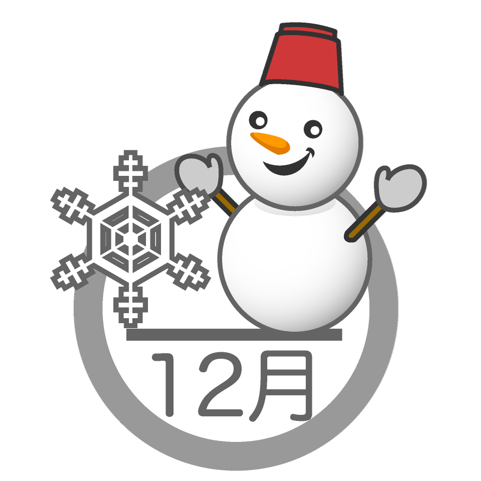

##  やまびこ通信2022年12月号

No.181

2022年12月9日発行

{: .migi}

ケス読み上げ時間:約 4分11秒

###  11月の活動報告

11月3日（木） 10日（木） 音訳フォローアップ講座

11月11日（金） 定例会・勉強会

11月17日（木） 音訳フォローアップ講座

11月25日（金） 定例会・勉強会

###  12月の活動予定

{: .migi}

12月1日（木） 8日（木） 音訳フォローアップ講座

12月9日（金） 定例会・勉強会

12月15日（木） 音訳フォローアップ講座

12月23日（金） 定例会・勉強会

###  録音図書 （デイジー版CD） 製作

{: .migi}

北区図書館情報11月及び北区の部屋だより第159号  
1時間

###  対面音訳

11月|87時間
|:---|---:|
今年度累計|589時間

###  十条台句会

{: .migi}

<ruby>食ひ<rp>(</rp><rt>くい</rt><rp>)</rp></ruby>ぞめの<ruby>式<rp>(</rp><rt>しき</rt><rp>)</rp></ruby>に きょとんと<ruby>小春<rp>(</rp><rt>こはる</rt><rp>)</rp></ruby>かな

<ruby>英子<rp>(</rp><rt>えいこ</rt><rp>)</rp></ruby>

###  Let&apos;s try!

{: .migi}

####  12月の問題

<blockquote markdown="1">

(1) <ruby>恭<rp>(</rp><rt>（　　　）</rt><rp>)</rp></ruby>しい

(2) <ruby>逆上<rp>(</rp><rt>（　　　）</rt><rp>)</rp></ruby>せる

(3) <ruby>四代目<rp>(</rp><rt>（　　　）</rt><rp>)</rp></ruby>（歌舞伎）

(4) <ruby>酸<rp>(</rp><rt>（　　　）</rt><rp>)</rp></ruby>い

(5) <ruby>二十歳<rp>(</rp><rt>（　　　）</rt><rp>)</rp></ruby>

(6) <ruby>20歳<rp>(</rp><rt>（　　　）</rt><rp>)</rp></ruby>

(7) <ruby>百会<rp>(</rp><rt>（　　　）</rt><rp>)</rp></ruby>

(8) <ruby>芳<rp>(</rp><rt>（　　　）</rt><rp>)</rp></ruby>しい

(9) <ruby>重五<rp>(</rp><rt>（　　　）</rt><rp>)</rp></ruby>（端午の節句）

(10) <ruby>時化<rp>(</rp><rt>（　　　）</rt><rp>)</rp></ruby>

</blockquote>

### 11月の解答

<blockquote markdown="1">

(1） 今回13代目<ruby>襲名披露<rp>(</rp><rt>しゅうめいひろう</rt><rp>)</rp></ruby> <ruby>吉例<rp>(</rp><rt>きちれい</rt><rp>)</rp></ruby> <ruby>顔見世<rp>(</rp><rt>かおみせ</rt><rp>)</rp></ruby> <ruby>大歌舞伎<rp>(</rp><rt>おおかぶき</rt><rp>)</rp></ruby>

(2） 歌舞伎十八蕃 市川<ruby>宗家<rp>(</rp><rt>そうけ</rt><rp>)</rp></ruby>のお<ruby>家芸<rp>(</rp><rt>いえげい</rt><rp>)</rp></ruby>、上演回数の多いのは <ruby>助六<rp>(</rp><rt>すけろく</rt><rp>)</rp></ruby>・<ruby>勧進帳<rp>(</rp><rt>かんじんちょう</rt><rp>)</rp></ruby>・<ruby>暫<rp>(</rp><rt>しばらく</rt><rp>)</rp></ruby>

(3） 歌舞伎には <ruby>和事<rp>(</rp><rt>わごと</rt><rp>)</rp></ruby>・<ruby>荒事<rp>(</rp><rt>あらごと</rt><rp>)</rp></ruby>があるが 初代・2代目・4代目は 荒事を得意とした。

(4） フォローアップで勉強している <ruby>外郎売<rp>(</rp><rt>ういろううり</rt><rp>)</rp></ruby>も十八番のひとつです。今回は八代目新之助が（6歳で上演しましたが）演じるようです。

(5) <ruby>毛抜<rp>(</rp><rt>けぬき</rt><rp>)</rp></ruby>と<ruby>鳴神<rp>(</rp><rt>なるかみ</rt><rp>)</rp></ruby>は「<ruby>雷神不動<rp>(</rp><rt>なるかみふどう</rt><rp>)</rp></ruby> <ruby>北山櫻<rp>(</rp><rt>きたやまざくら</rt><rp>)</rp></ruby>」の 通し狂言の一部を独立させたもの。

(6） 自分を誇示するような態度の <ruby>見得<rp>(</rp><rt>みえ</rt><rp>)</rp></ruby>には「暫くの元禄見得」・「勧進帳の石投げの見得」・「鳴神の<ruby>柱巻<rp>(</rp><rt>はしらまき</rt><rp>)</rp></ruby>の見得」・「曽我対面の<ruby>絵面<rp>(</rp><rt>えめん</rt><rp>)</rp></ruby>の見得」などがある。

(7) 荒事の化粧の中でも<ruby>隈取<rp>(</rp><rt>くまどり</rt><rp>)</rp></ruby>は特徴的です、<ruby>紅隈<rp>(</rp><rt>べにぐま</rt><rp>)</rp></ruby>は正義や勇気、<ruby>茶隈<rp>(</rp><rt>ちゃぐま</rt><rp>)</rp></ruby>は鬼や精霊。

</blockquote>

定例会： 第2金曜日・第4金曜日10時～12時/北区立中央図書館3階

連絡先： 音訳グループやまびこ代表 大川薫

電話番号：03-3910-7331

<a href="mailto:ymbk2016ml@gmail.com?Subject=やまびこウェブサイトについて" data-dur="5.930" data-begin="237.727" id="xmri_0054" markdown="1">このサイトについてはこちらへ</a>

